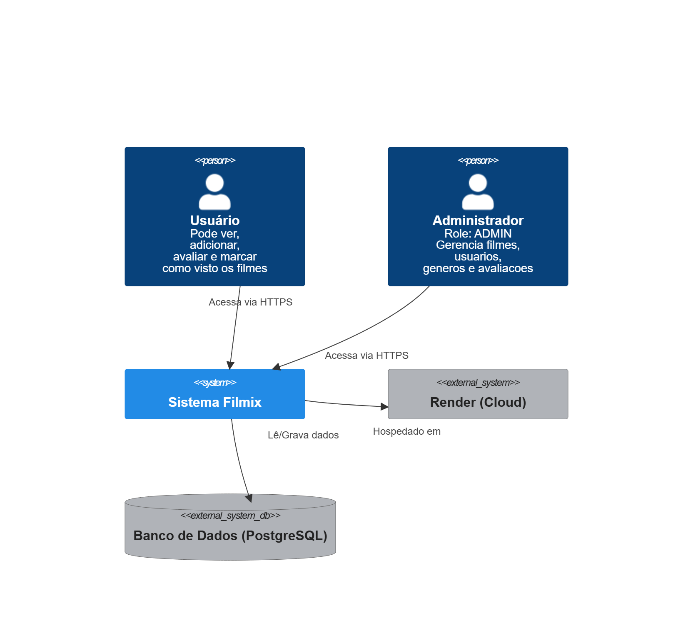
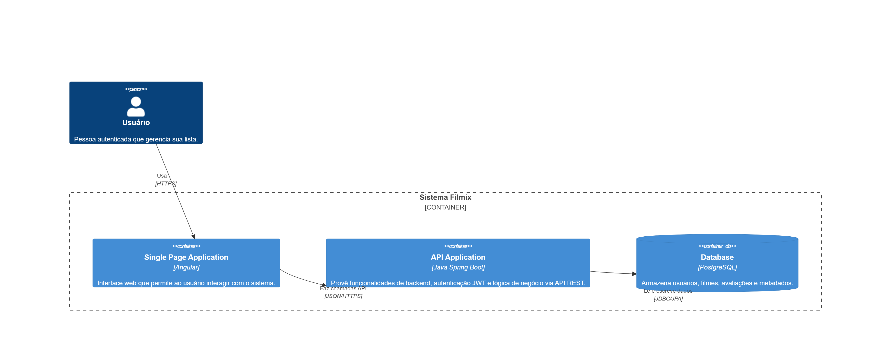
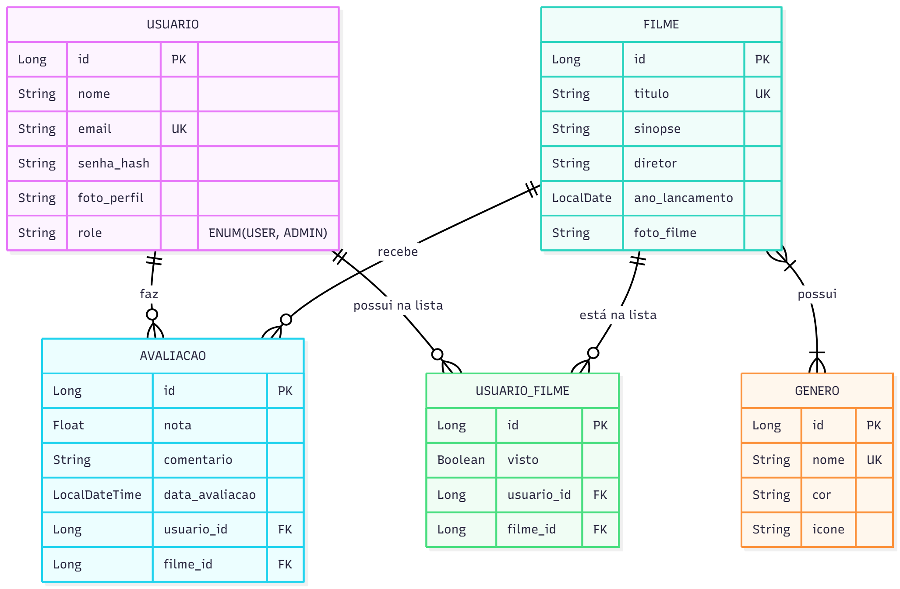
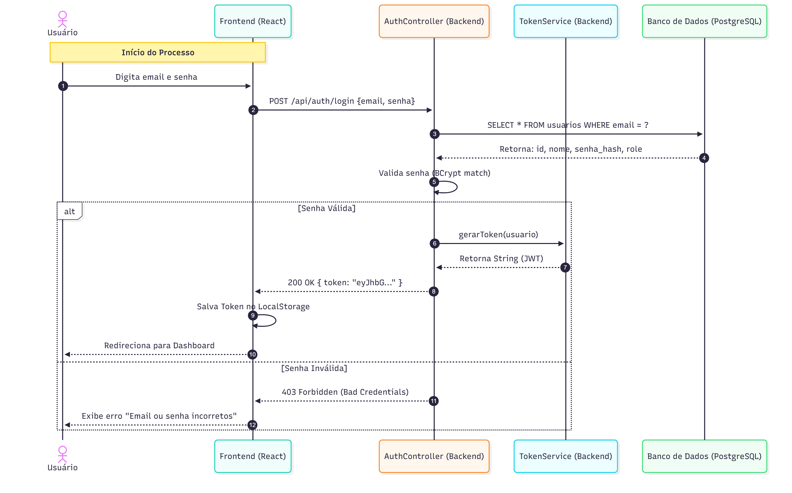
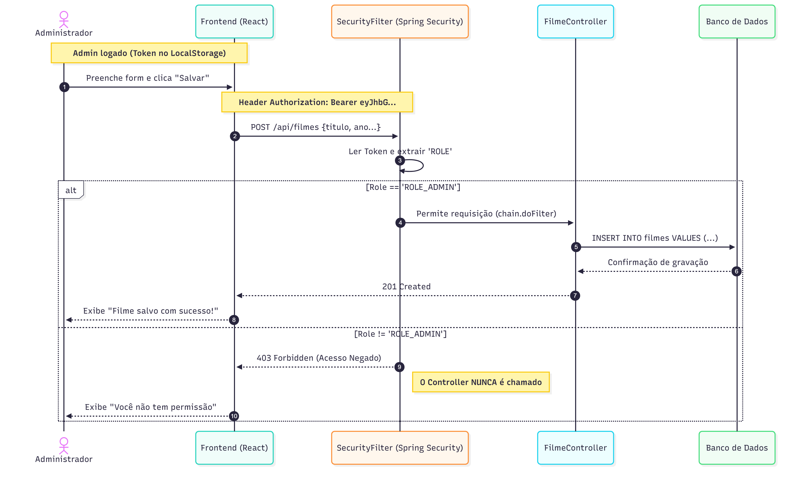

# Filmix — Gerenciador de Filmes e Séries 🎬

   

## 🔗 Links do Projeto (Deploy)
A aplicação está rodando publicamente na nuvem (Render):
* **Aplicação (Frontend):** [https://filmix-front.onrender.com](https://filmix-front.onrender.com)
* **API (Backend):** [https://filmix-api-9c9j.onrender.com](https://filmix-api-9c9j.onrender.com)
* **Documentação (Swagger):** [https://filmix-api-9c9j.onrender.com/swagger-ui.html](https://filmix-api-9c9j.onrender.com/swagger-ui.html)

---

## 1) Problema
Muitas pessoas assistem filmes e séries, mas acabam esquecendo quais já viram, quais ainda querem assistir e qual nota dariam para cada obra.
Isso gera desorganização, repetições indesejadas e dificuldade em recomendar conteúdos para amigos.
O foco inicial é no **usuário individual**, com o objetivo de permitir que ele registre, organize e atribua notas (0 a 10) às produções assistidas.

## 2) Atores e Decisores
* **Usuários principais:** Pessoas que desejam organizar seus filmes e séries assistidos.
* **Decisores/Apoiadores:** Administradores; equipe de desenvolvimento.

## 3) Casos de uso (Simplificado)
**Todos:**
* Logar/deslogar do sistema.
* Manter dados cadastrais.

**Usuário:**
* Manter (inserir, mostrar, editar, remover) filmes/séries.
* Marcar filmes/séries como vistos ou não vistos.
* Atribuir nota de 0 a 10 para cada filme/série.
* Filtrar lista por status (vistos / não vistos).

## 4) Limites e suposições
* **Limites:** prazo final da disciplina; rodar no navegador; sem serviços pagos.
* **Suposições:** acesso à internet, navegador atualizado, Render para deploy.
* **Plano B:** se não houver internet → rodar local; se não houver tempo → testar fluxos críticos.

## 5) Hipóteses + validação
* **H-Valor:** Se o usuário puder registrar e avaliar seus filmes, então terá mais controle sobre seu histórico de entretenimento, melhorando sua organização.
    * *Validação:* teste com 5 usuários; sucesso se ≥4 conseguirem cadastrar e avaliar sem ajuda.
* **H-Viabilidade:** Com React + Spring Boot + PostgreSQL, cadastrar e listar filmes responde em até 1 segundo.
    * *Validação:* medir no deploy com 30 ações.

## 6) Fluxo principal e primeira fatia
**Fluxo principal:**
1. Usuário faz login.
2. Adiciona filme/série.
3. Sistema salva no banco (Spring Boot + PostgreSQL).
4. Frontend exibe o filme na lista com status e nota.

**Primeira fatia vertical (MVP):**
Inclui: login simples, cadastrar filme, listar filmes, marcar como visto.

## 7) Arquitetura e System Design
[cite_start]Conforme requisitos do trabalho, abaixo estão os diagramas arquiteturais[cite: 7, 80, 81].

### 7.1 Contexto e Containers (C4)
* **Diagrama de Contexto:**
  

* **Diagrama de Containers:**
  

### 7.2 Modelo de Dados (ERD)
* **Diagrama ERD:**
  

### 7.3 Diagramas de Sequência
* **Fluxo de Login:**
  

* **Fluxo de Criar Filme (Admin):**
  

### 7.4 Esboços de Telas (Wireframes)
* **Tela de Login:** 
* **Tela de Dashboard:** 
* **Tela de Lista de Filmes:** 
* **Tela de Gêneros:** 

## 8) Tecnologias
### 8.1 Navegador
* **Navegador:** Chrome/Firefox/Edge.
* **Hospedagem Front-end:** Render (Static Site).

### 8.2 Front-end (React)
* **Framework:** React.js (Create React App).
* **Comunicação com API:** Axios (REST API).
* **Roteamento:** React Router Dom.

### 8.3 Back-end (API com Spring Boot)
* **Framework:** Spring Boot 3 (Java 17).
* **Banco de dados:** PostgreSQL (Render Cloud).
* **Segurança:** Spring Security + JWT.
* **Gerenciador de Dependências:** Maven.

## 9) Plano de Dados
### 9.1 Entidades
* **Usuarios:** Pessoa que usa o sistema. Possui Role (USER/ADMIN).
* **Filmes:** Catálogo principal.
* **Generos:** Categorias para classificação.
* **Avaliacoes:** Nota e comentário de um usuário para um filme.

### 9.2 Script SQL de Criação (Referência)
```sql
CREATE TABLE usuarios (
    id SERIAL PRIMARY KEY,
    nome VARCHAR(100) NOT NULL,
    email VARCHAR(200) NOT NULL UNIQUE,
    senha_hash VARCHAR(255) NOT NULL,
    role VARCHAR(20) NOT NULL,
    foto_perfil VARCHAR(255)
);

CREATE TABLE filmes (
    id SERIAL PRIMARY KEY,
    titulo VARCHAR(255) NOT NULL UNIQUE,
    sinopse VARCHAR(255),
    ano_lancamento INT,
    url_capa VARCHAR(255),
    url_trailer VARCHAR(255)
);