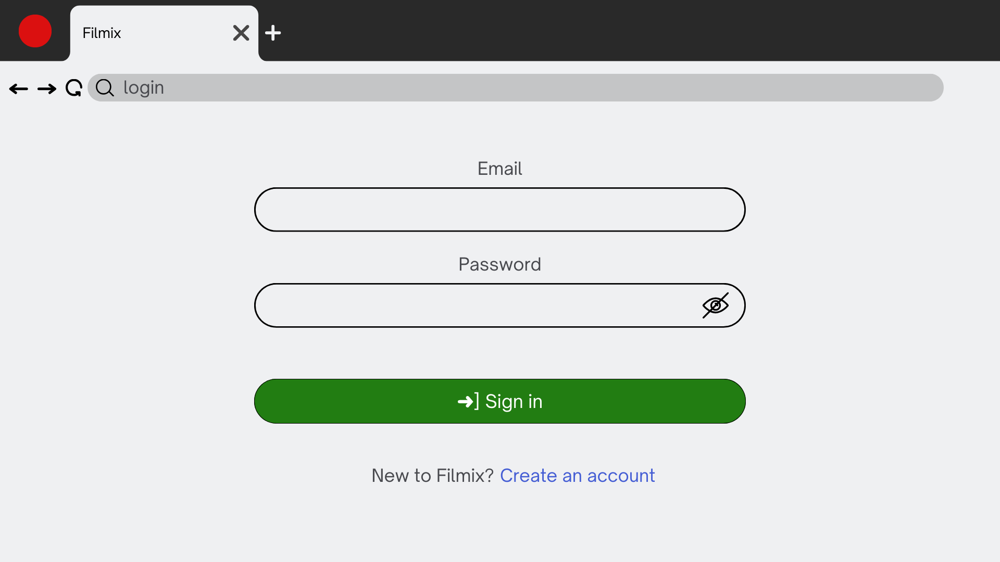
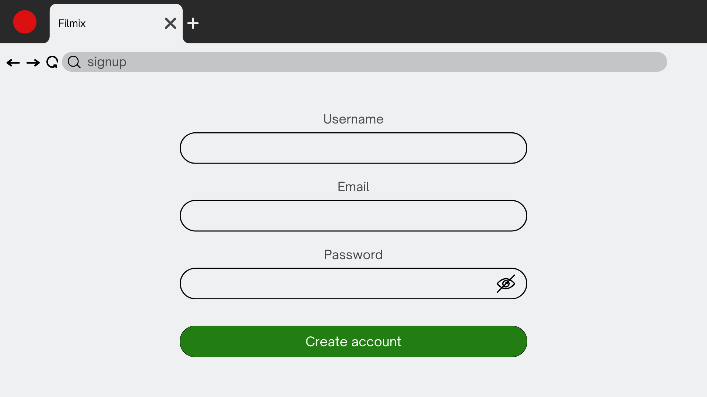
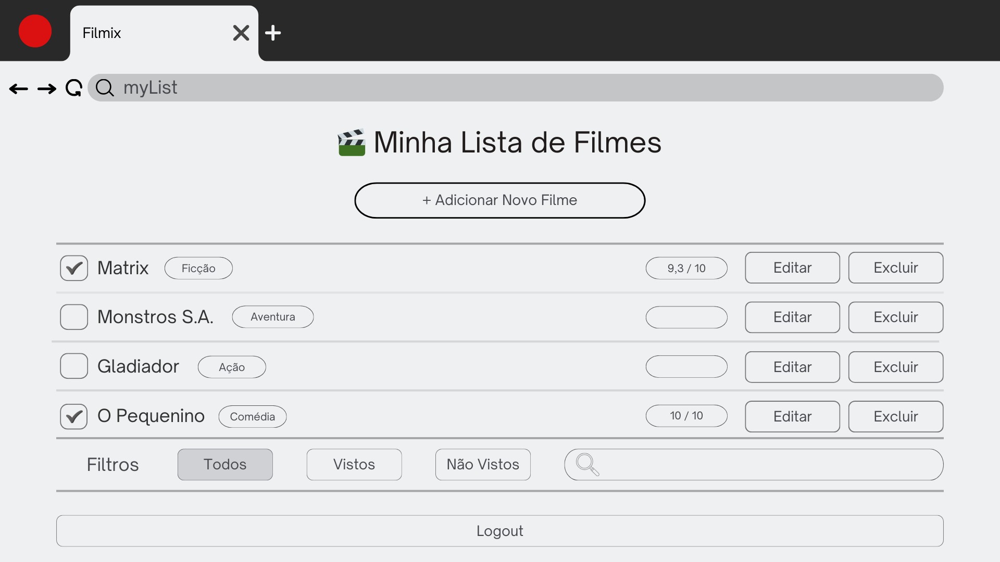
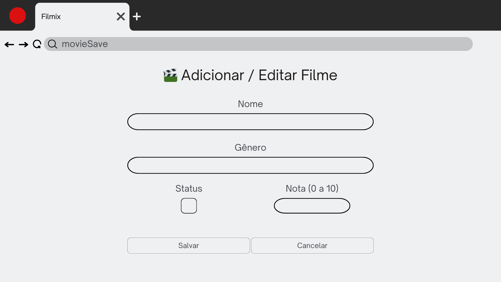

# Filmix — Gerenciador de Filmes e Séries 🎬

## 1) Problema
Muitas pessoas assistem filmes e séries, mas acabam esquecendo quais já viram, quais ainda querem assistir e qual nota dariam para cada obra.  
Isso gera desorganização, repetições indesejadas e dificuldade em recomendar conteúdos para amigos.  
O foco inicial é no **usuário individual**, com o objetivo de permitir que ele registre, organize e atribua notas (0 a 10) às produções assistidas.

## 2) Atores e Decisores (quem usa / quem decide)
**Usuários principais:** Pessoas que desejam organizar seus filmes e séries assistidos.  
**Decisores/Apoiadores:** Administradores; equipe de desenvolvimento

## 3) Casos de uso (de forma simples)
Todos: Logar/deslogar do sistema; Manter dados cadastrais.  
Usuário:
- Manter (inserir, mostrar, editar, remover) filmes/séries.
- Marcar filmes/séries como vistos ou não vistos.
- Atribuir nota de 0 a 10 para cada filme/série.
- Filtrar lista por status (vistos / não vistos).

## 4) Limites e suposições
**Limites:** prazo final da disciplina; rodar no navegador; sem serviços pagos.  
**Suposições:** acesso à internet, navegador atualizado, GitHub para deploy, tempo do professor para avaliação.  
**Plano B:** se não houver internet → rodar local com banco H2 no Spring Boot; se não houver tempo do professor → testar com colegas.

## 5) Hipóteses + validação
**H-Valor:** Se o usuário puder registrar e avaliar seus filmes, então terá mais controle sobre seu histórico de entretenimento, melhorando sua organização.  
**Validação (valor):** teste com 5 usuários; sucesso se ≥4 conseguirem cadastrar, marcar como visto e avaliar sem ajuda.

**H-Viabilidade:** Com Angular + Spring Boot + SQLite/Postgres, cadastrar e listar filmes responde em até 1 segundo.  
**Validação (viabilidade):** medir no protótipo com 30 ações; meta: pelo menos 27 de 30 ações em ≤1s.

## 6) Fluxo principal e primeira fatia
**Fluxo principal (curto):**
1) Usuário faz login
2) Adiciona filme/série
3) Sistema salva no banco (Spring Boot + DB)
4) Angular exibe o filme na lista com status e nota

**Primeira fatia vertical (escopo mínimo):**  
Inclui: login simples, cadastrar filme, listar filmes em ordem, marcar como visto.  
**Critérios de aceite:**
- Criar filme → aparece na lista com status e nota.
- Marcar como visto → muda o status para ✔ Visto.

## 7) Esboços de algumas telas (wireframes)
### Tela de Login


### Tela de Cadastro


### Tela de Lista de Filmes


### Tela de Adicionar/Editar Filme


## 8) Tecnologias
### 8.1 Navegador
**Navegador:** Chrome/Firefox/Edge (compatível com Angular)  
**Hospedagem Front-end:** GitHub Pages ou Vercel

### 8.2 Front-end (Angular)
**Framework:** Angular  
**Estilização:** Angular Material / Bootstrap  
**Comunicação com API:** HTTPClient (REST API)  
**Hospedagem:** Vercel / Netlify

### 8.3 Back-end (API com Spring Boot)
**Framework:** Spring Boot (Java 17+)  
**Banco de dados:** PostgreSQL (executado via Docker)  
**Segurança:** Spring Security + JWT (autenticação)
**Gerenciador de Dependências:** Maven

## 9) Plano de Dados (Dia 0) — somente itens 1–3
### 9.1 Entidades
- Usuarios — Pessoa que usa o sistema, pode se cadastrar, fazer login, ter uma lista pessoal de filmes e fazer avaliações.
- Filmes — Filme cadastrado no sistema. Contém informações como título, sinopse, diretor e pode ser associada a gêneros e avaliações.
- Generos — Categoria utilizada para classificar os filmes (ex: Ação, Comédia, Drama), ajudando na organização e busca dentro do catálogo.
- Avaliacoes — Opinião de um usuário sobre um filme, consistindo em uma nota e um comentário. Cada avaliação está ligada a um usuário e a um filme específico.

### 9.2 Campos por entidade

#### Entidade: `usuarios`

| Campo | Tipo | Obrigatório? | Exemplo |
| :--- | :--- | :--- | :--- |
| id | SERIAL | Sim | 1 |
| nome | texto | Sim | "Jordan Ebertz" |
| email | texto | Sim (único) | "rosana.ebertz@gmail.com" |
| senha_hash | texto | Sim | "$2a$10$..." |
| foto_perfil | texto | Não | "https://ogimg.infoglobo.com.br/in/20456620-302-c5b/FT1086A/760/Ibere.jpg" |

#### Entidade: `generos`

| Campo | Tipo | Obrigatório? | Exemplo |
| :--- | :--- | :--- | :--- |
| id | SERIAL | Sim | 1 |
| nome | texto | Sim (único) | "Ficção Científica" |

#### Entidade: `filmes`

| Campo | Tipo | Obrigatório? | Exemplo |
| :--- | :--- | :--- | :--- |
| id | SERIAL | Sim | 1 |
| titulo | texto | Sim (único) | "Interestelar" |
| sinopse | texto | Não | "As reservas da Terra estão..." |
| diretor | texto | Não | "Christopher Nolan" |
| ano_lancamento | data | Não | "2014-11-06" |
| foto_filme | texto | Não | "https://link.com/poster.png"|

#### Entidade: `avaliacoes`

| Campo | Tipo | Obrigatório? | Exemplo |
| :--- | :--- | :--- | :--- |
| id | SERIAL | Sim | 1 |
| usuario_id | número (fk) | Sim | 1 |
| filme_id | número (fk) | Sim | 1 |
| nota | número | Sim | 9.8 |
| comentario | texto | Não | "Filme espetacular!" |
| data_avaliacao | data/hora | Sim | "2025-09-10 21:30:00" |

#### Entidade: `filme_genero` (Tabela de Junção)

| Campo | Tipo | Obrigatório? | Exemplo |
| :--- | :--- | :--- | :--- |
| filme_id | número (fk) | Sim | 1 |
| genero_id | número (fk) | Sim | 1 |

#### Entidade: `usuario_lista_filmes` (Tabela de Junção)

| Campo | Tipo | Obrigatório? | Exemplo |
| :--- | :--- | :--- | :--- |
| usuario_id | número (fk) | Sim | 1 |
| filme_id | número (fk) | Sim | 1 |

### 9.3 Relações entre entidades

-   Um **Usuario** pode ter muitas **Avaliacoes** (1→N).
-   Uma **Avaliacao** pertence a um **Usuario** (N→1).
-   Um **Filme** pode ter muitas **Avaliacoes** (1→N).
-   Uma **Avaliacao** é sobre um **Filme** (N→1).
-   Um **Filme** pode ter muitos **Generos** (N↔N, resolvido pela tabela `filme_genero`).
-   Um **Usuario** pode ter muitos **Filmes** em sua lista pessoal (N↔N, resolvido pela tabela `usuario_lista_filmes`).

### 9.4 Modelagem no PostgreSQL

*A aplicação está configurada com `spring.jpa.hibernate.ddl-auto=update`. O script DDL abaixo serve como documentação da estrutura que é gerada automaticamente pela aplicação ao ser iniciada.*


```sql
-- -> DDL (Data Definition Language)

-- ======================
-- Tabela: usuarios
-- ======================
CREATE TABLE IF NOT EXISTS usuarios (
    id                SERIAL PRIMARY KEY,
    nome              VARCHAR(100) NOT NULL,
    email             VARCHAR(200) NOT NULL UNIQUE,
    senha_hash        VARCHAR(255) NOT NULL,
    foto_perfil       VARCHAR(255)
);

-- ======================
-- Tabela: generos
-- ======================
CREATE TABLE IF NOT EXISTS generos (
    id     SERIAL PRIMARY KEY,
    nome   VARCHAR(50) NOT NULL UNIQUE
);

-- ======================
-- Tabela: filmes
-- ======================
CREATE TABLE IF NOT EXISTS filmes (
    id             SERIAL PRIMARY KEY,
    titulo         VARCHAR(255) NOT NULL UNIQUE,
    sinopse        VARCHAR(255),
    diretor        VARCHAR(100),
    ano_lancamento DATE,
    foto_filme     VARCHAR(255)
);

-- ======================
-- Tabela: avaliacoes
-- ======================
CREATE TABLE IF NOT EXISTS avaliacoes (
    id             SERIAL PRIMARY KEY,
    usuario_id     INTEGER NOT NULL REFERENCES usuarios(id) ON DELETE CASCADE,
    filme_id       INTEGER NOT NULL REFERENCES filmes(id) ON DELETE CASCADE,
    nota           NUMERIC(3,1) NOT NULL CHECK (nota >= 0.0 AND nota <= 10.0),
    comentario     VARCHAR(255),
    data_avaliacao TIMESTAMP WITH TIME ZONE NOT NULL DEFAULT CURRENT_TIMESTAMP
);

-- ======================
-- Tabela: filme_genero (Junção N-N)
-- ======================
CREATE TABLE IF NOT EXISTS filme_genero (
    filme_id  INTEGER NOT NULL REFERENCES filmes(id) ON DELETE CASCADE,
    genero_id INTEGER NOT NULL REFERENCES generos(id) ON DELETE CASCADE,
    PRIMARY KEY (filme_id, genero_id)
);

-- ======================
-- Tabela: usuario_lista_filmes (Junção N-N)
-- ======================
CREATE TABLE IF NOT EXISTS usuario_lista_filmes (
    usuario_id INTEGER NOT NULL REFERENCES usuarios(id) ON DELETE CASCADE,
    filme_id   INTEGER NOT NULL REFERENCES filmes(id) ON DELETE CASCADE,
    PRIMARY KEY (usuario_id, filme_id)
);


-- -> DML (Data Manipulation Language) - Inserções de Teste

-- Inserindo usuários
INSERT INTO usuarios (nome, email, senha_hash) VALUES
('Jordan Ebertz', 'rosana.ebertz@gmmail.com', '$2a$10$abcdef...'),
('Bruno Costa', 'bruno.costa@email.com', '$2a$10$ghijkl...');

-- Inserindo gêneros
INSERT INTO generos (nome) VALUES ('Ficção Científica'), ('Ação'), ('Drama');

-- Inserindo filmes
INSERT INTO filmes (titulo, diretor, ano_lancamento) VALUES
('Interestelar', 'Christopher Nolan', '2014-11-06'),
('O Poderoso Chefão', 'Francis Ford Coppola', '1972-09-08');

-- Associando filmes com gêneros
INSERT INTO filme_genero (filme_id, genero_id) VALUES
(1, 1), -- Interestelar -> Ficção Científica
(1, 3), -- Interestelar -> Drama
(2, 3); -- O Poderoso Chefão -> Drama

-- Inserindo avaliações
INSERT INTO avaliacoes (usuario_id, filme_id, nota, comentario) VALUES
(1, 1, 9.8, 'Visualmente incrível e com uma história emocionante.'),
(2, 2, 10.0, 'Obra-prima do cinema.');

-- Adicionando filmes à lista de usuários
INSERT INTO usuario_lista_filmes (usuario_id, filme_id) VALUES
(1, 1), -- Jordan adicionou Interestelar à sua lista
(1, 2), -- Jordan adicionou O Poderoso Chefão à sua lista
(2, 1); -- Bruno adicionou Interestelar à sua lista


-- -> DQL (Data Query Language) - Consultas de Teste

-- 1. Retorna todos os filmes e seus diretores.
SELECT titulo, diretor FROM filmes;

-- 2. Retorna os gêneros do filme com id = 1 ('Interestelar').
SELECT g.nome
FROM generos g
JOIN filme_genero fg ON g.id = fg.genero_id
WHERE fg.filme_id = 1;

-- 3. Retorna todas as avaliações com o nome do usuário e o título do filme.
SELECT u.nome AS usuario, f.titulo AS filme, a.nota, a.comentario
FROM avaliacoes a
JOIN usuarios u ON a.usuario_id = u.id
JOIN filmes f ON a.filme_id = f.id;

-- 4. Retorna a nota média do filme com id = 1 ('Interestelar').
SELECT AVG(nota) AS nota_media_interestelar
FROM avaliacoes
WHERE filme_id = 1;

-- 5. Retorna os filmes na lista pessoal da usuária 'Jordan Ebertz'.
SELECT f.titulo
FROM filmes f
JOIN usuario_lista_filmes ulf ON f.id = ulf.filme_id
JOIN usuarios u ON u.id = ulf.usuario_id
WHERE u.nome = 'Jordan Ebertz';
SELECT AVG(a.nota) AS nota_media FROM avaliacoes a JOIN filmes f ON a.filme_id = f.id WHERE f.titulo = 'Interestelar';

-- 5. Mostra os filmes na lista da usuária 'Jordan Ebertz'.
SELECT f.titulo FROM filmes f JOIN usuario_lista_filmes ulf ON f.id = ulf.filme_id JOIN usuarios u ON u.id = ulf.usuario_id WHERE u.nome = 'Jordan Ebertz';